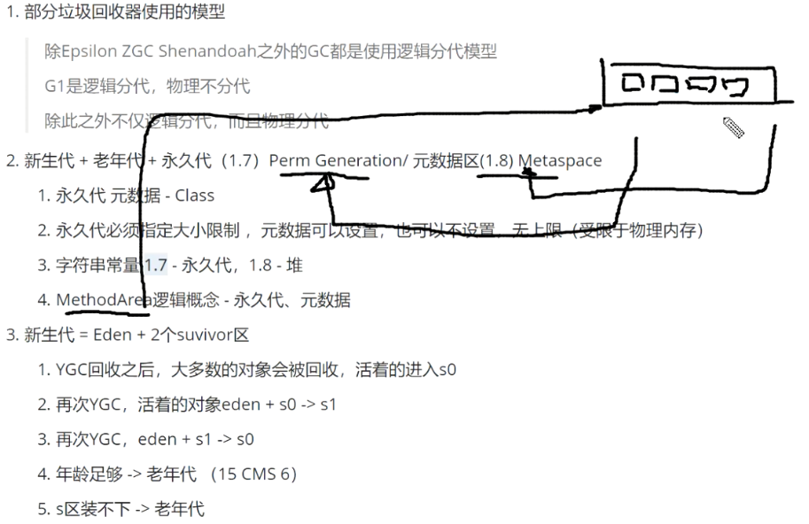
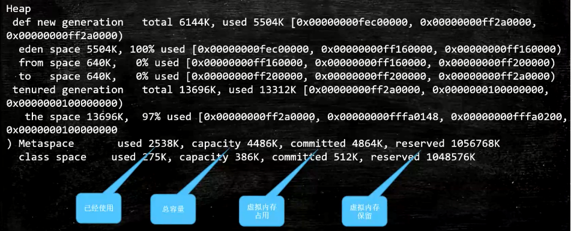

### 内存分配
- 新生代+老年代 = 堆内存

减少FGC

### GC日志详解

### OutMemory GCheap日志信息
> total = eden + 1个survivor （from 或 to）


### JVM调优的基础概念
1. 吞吐量：业务代码时间/（用户代码执行时间 + GC时间）
2. 响应时间：STW越短，响应时间越好
> 所谓调优，首先确定追求啥？吞吐量优先，还是响应时间优先？还是在满足一定响应时间的情况下，要求达到多大吞吐量
3. 问题：
    1. 科学计算，数据挖掘 thrput --- 吞吐量优先选（ps+po）
    2. 网站 GUI API ---- 响应时间优先（1.8 G1）
### 什么是调优？
1. 根据需求进行JVM规划和预调优
2. 优化JVM运行环境
3. 解决JVM运行过程中出现的各种问题（OOM）

- 调优，从业务场景出发
- 监控，压力测试，能看到结果
- 步骤
  1. 熟悉业务场景（选定垃圾回收器，没有最好的，只有最合适的）
     1. 响应时间，停顿时间【CMS G1 ZGC】
     2. 吞吐量 = 用户时间**/**(用户时间+GC时间) 
  2. 选择回收器组合
  3. 计算内存需求
  4. 选定CPU 越高越好
  5. 设定年代大小，年龄升级
  6. 设定日志参数
    ```
     -Xloggc:/opt/jvm/xxx-xxx-gc-%t.log -XX:+UseGCLogFileRotation -XX:NumberOfGCLogFiles=5 -XX:GCLogFileSize=20M -XX:+PrintGCDetails -XX:+PrintGCDateStamps -XX:+PrintGCCause
    ```
    ```
    // 使用 G1
    -Xms1024M -Xmx1024M -XX:PermSize=128m -XX:MaxPermSize=512m -XX:+UseG1GC -Xloggc:F:\jvmlog\problem\dossiers-gc-%t.log -XX:+UseGCLogFileRotation -XX:NumberOfGCLogFiles=5 -XX:GCLogFileSize=20M -XX:+PrintGCDetails -XX:+PrintGCDateStamps -XX:+PrintGCCause -XX:InitiatingHeapOccupancyPercent=30 -XX:MaxGCPauseMillis=100
    ```
  7. 观察日志情况
- **案例1**：垂直电商 最高每日百万订单，出出力系统需要什么样的服务器配置？
  1. 找峰值（1小时36w，一小时内高峰《可能100，1000订单/秒》）
  2. 非要计算：一个订单生产需要多少内存 521*1000 500M内存 搞定
  3. 设定响应时间压测 100ms
- **案例2** ：12306春节大规模抢票应该如何支撑？
#### 优化环境

1. 有一个50万PV的资料网站（从磁盘提取文档到内存）原服务器32位，1.5G堆，用户反馈网站比较慢，决定升级行服务器为64位，16G堆 结果效率更低了

   1. 为啥慢：

      很多用户浏览数据，load 到内存

   2. 为啥会更卡

   3. 怎么办

      1. PS -> PG + GMC -> G1

2. 系统CPU经常100% 如果调优？**【必定有线程在占用CPU资源】**
> 列出java进程使用命令 jps
   1. 先找出占用CPU高的 进程  (**top**)
   2. 该进程中线程cpu高（**top -Hp [pid]**）
   3. java程序，导出线程堆栈 (**jstack -l [线程pid的十六进制]**)
        1. 重点关注线程状态   
   4. 查找对应方法（栈帧）消耗时间 （**jstack**）

3. 系统内存飙高，如何查找问题？**【堆占用较高】**
    1. jmap -histo [pid] | head -20 (分析占用堆内存占用最大的前20个）
    2. jmap -dump:format=b,file=[filepath.hprof] [pid]
        ```
        format=b，表示以字节的形式
        pid java进程的进程号
        ```
        1. 设定参数 HeapDump, OOM的时候会自动产生堆转存储文件
        ```
        format=b，表示以字节的形式
        pid java进程的进程号
        java -Xms20M -Xmx20M -XX:UseParallerGC -XX:+HeapDumpOnOutOfMemoryError -XX:HeapDumpPath=G:\heapdump
        ```
        2. 现上系统，内存特别大，jmap执行期间会对进程产生很大影响，甚至卡顿（电商不适合）
        3. <font color='red'>很多服务器备份（高可用），停掉这台服务器对他服务器不影响</font>
    3. 在线定位 使用 arthas
    
   2. 分析 （**jhat jvisualvm mat jprofiler ....**）

4. 如何监控JVM

   1. jstat jvisualvm 、、、、

### top -> top -Hp [pid] -> jstack [pid] ->(死锁类的 较简单)
- jstack [pid] 查看发现垃圾回收线程占用时间较长 对象回收不了，查看哪个对象占用最多 <jmap> jmap -histo [pid] | head -20

图形化：jconsole/jvisualVM/jprofiler(最好用，花钱) 压测监控
jmap -histo [pid] head -20

### oom

### arthas使用
1. 先下载
2. 解压
3. 使用java -jar  **-boot.jar文件启动
4. 输入进程号进行监控
5. 使用heapdump  /root/1.hprof导出堆栈信息（导出费时间）
6. 使用jhat -J-mx512M  1.hprof分析堆栈信息
7. 然后使用http访问查看分析结构
