### java从编码到执行
.png)
### 编译加载class文件---混合模式

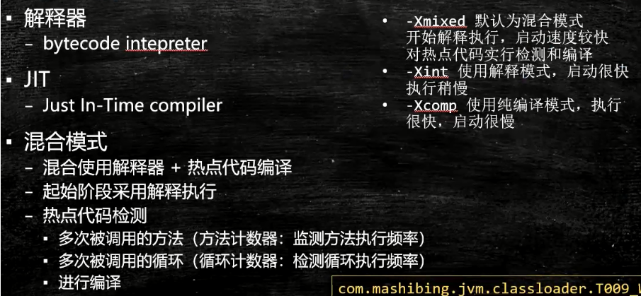

### 跨语言平台


1. jvm与class文件相关
- jvm与java无关

  ```
  任何语言 ----》 class文件 ----》 JVM
  ```

  
### jvm是一种规范

### 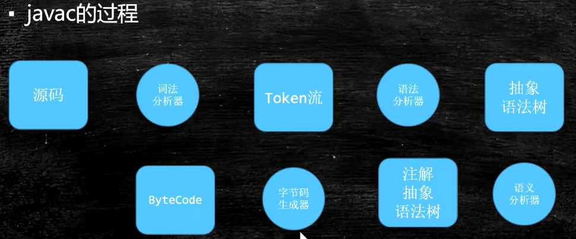

### 常见jvm虚拟机
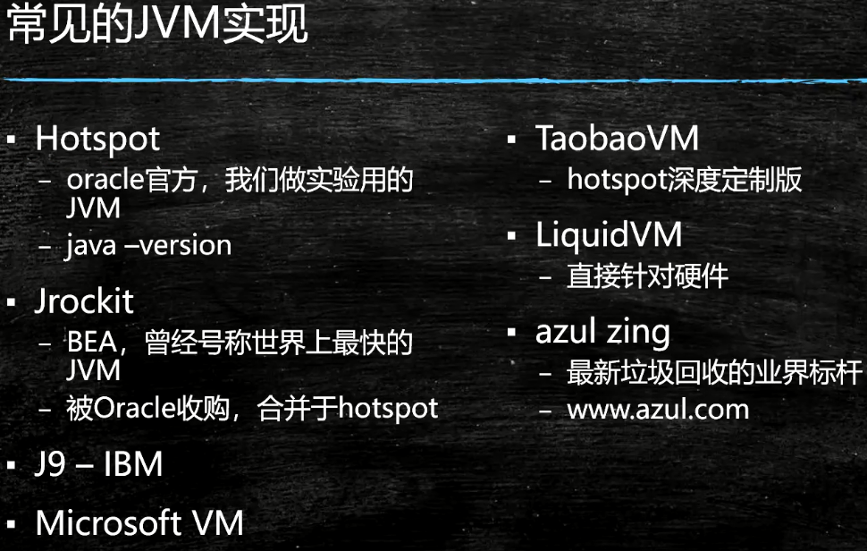
### JDK JRE JVM 关系


### class File Format
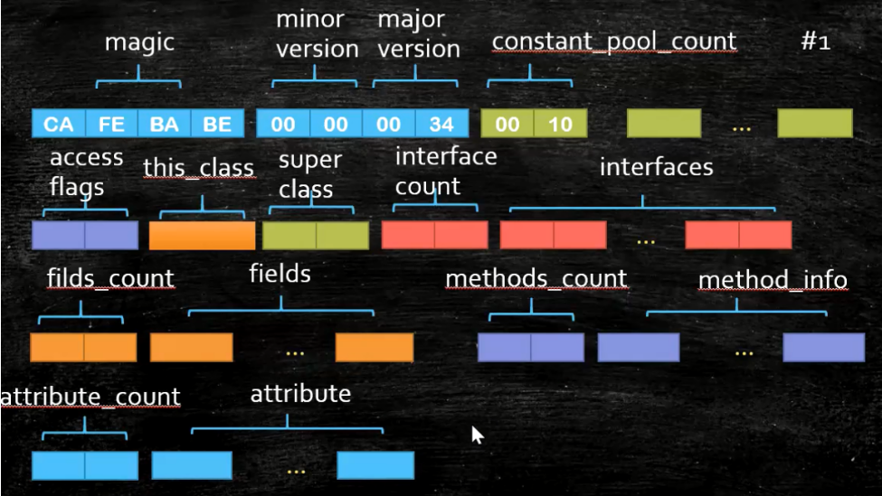


### 字节含义cuiyip
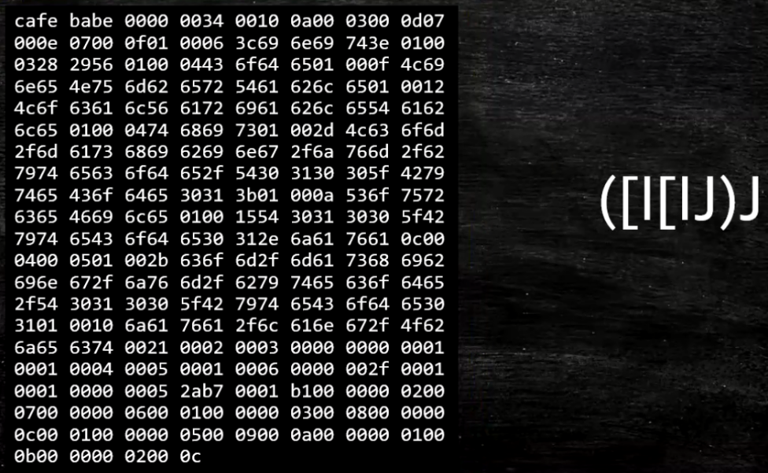
- int I
- long J
- 数组 [
### class加载过程
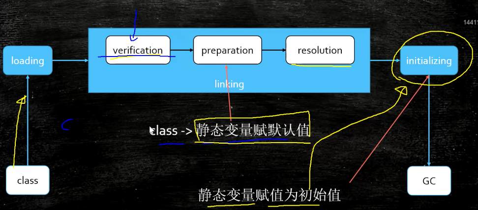
- verification(验证文件是否符合jvm规定)
- preparation(静态变量赋默认值)
- resolution
- initializing(调用类构造函数，静态变量值初始化)

#### 压栈过程
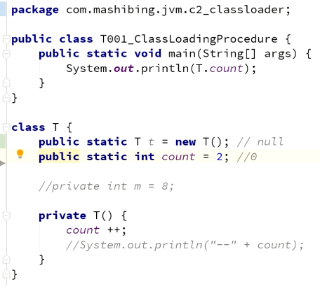
- 类加载器(默认双亲委派机制)
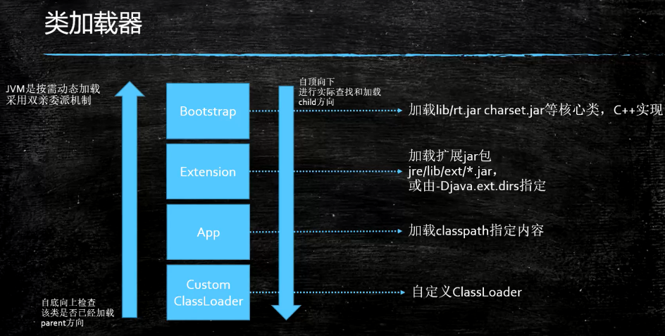
- ClassLoader
    - 自定义类有 AppClassLoader加载
### 类加载过程（双亲委派---从子到父，在从父到子的过程）
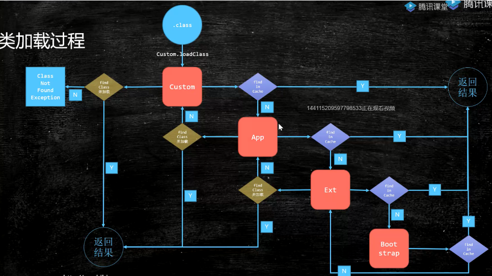
- 为什么使用双亲委派机制
    - 防止重复加载
    - 安全问题，java.long.String类由自定义加载器加载 直接加载覆盖java核心类库（密码存放）
    - 初始刷子类是，父类首先初始化
- 如何打破双亲委派机制
    - 重写loadClass()方法
    - jdk1.2之前自定义ClassLoader必须重写loadClass()<没有findClass（）>
    - ThreadContextClassLoader 实现基础类调用，thread.setContextClassLoader 指定
    - 热启动，热部署
        - osgi tomcate都有自己的模块指定classLoader 
- 类加载源码
    - 使用设计模式（钩子函数/模板方法）
    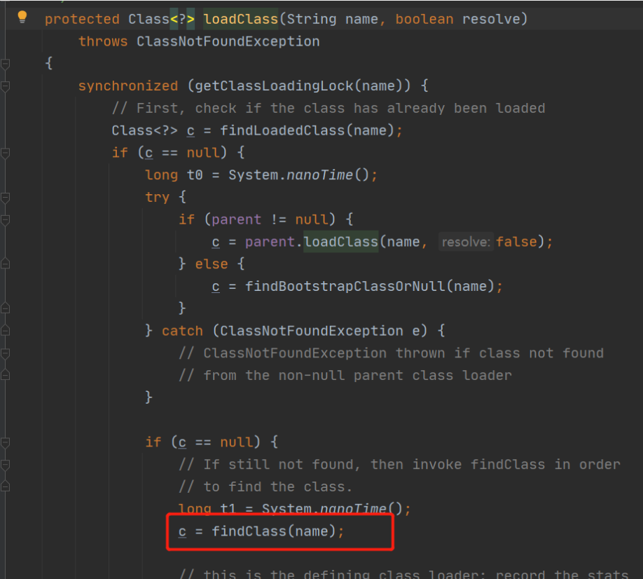
    - 自定义类加载器ClassLoader 
    - extends ClassLoader
    - Overwrite findClass() -> defineClass(byte[] -> Class clazzs)
    - 加密
    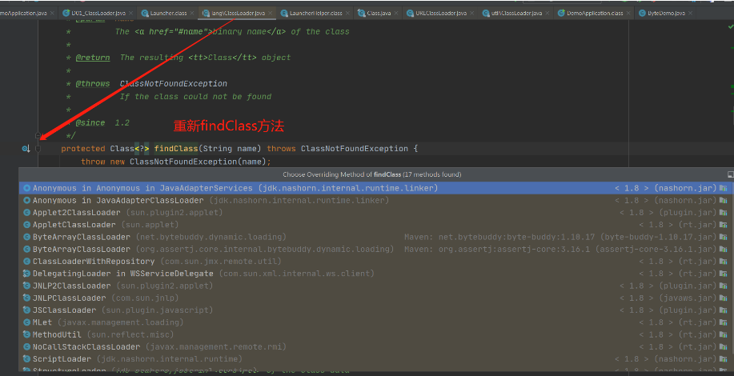
- class文件loader到内存
    - 解释器执行（**bytecode intepreter**）
    - jit 热点编译（代码本地化）效率优化
#### 检测热点代码参数
- -XX:CompileThreshold = 10000

### JVM内存模型
#### 硬件层的并发优化模型
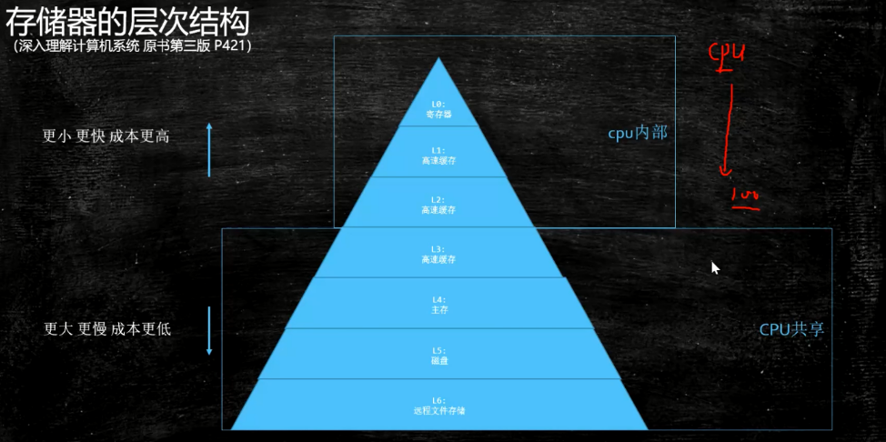

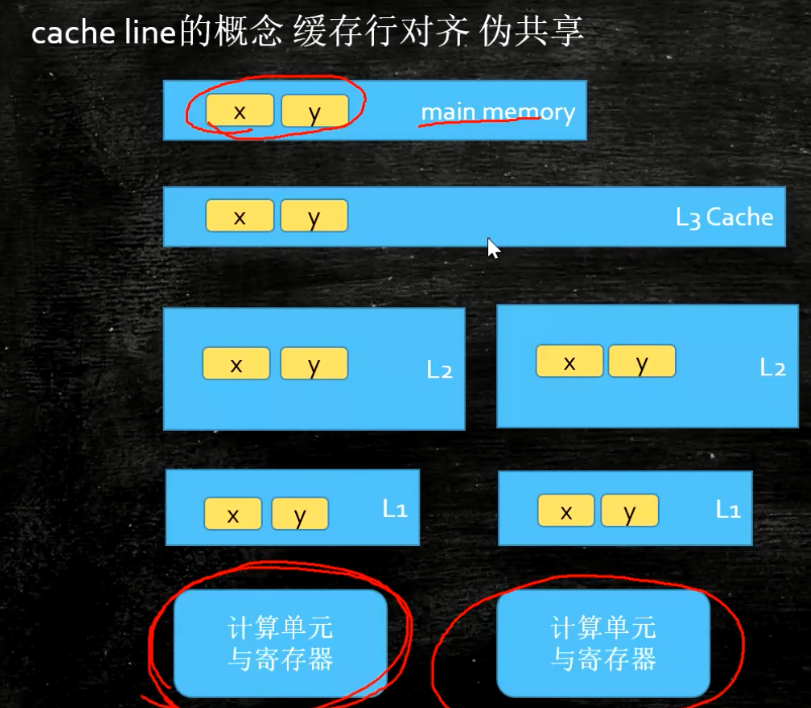
- 解决内存一致性问题
    1. 总线锁（性能低）
    2. 缓存一致性协议（MESI）--- 缓存锁+总线锁
    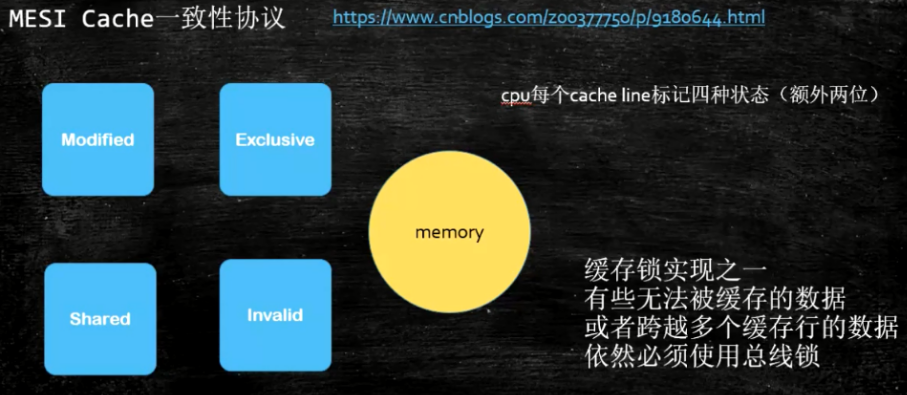
- 缓存行（cache line）64个字节
    - 伪共享---> 位于同一缓存行的两个不同数据，被不同cpu锁定，产生相互影响的伪共享问题
    
    - 合并写缓存（writCombining）cup 4个字节
    
    - intel 用MESI
    
      https://www.cnblogs.com/z00377750/p/9180644.html
    
      现代CPU的数据一致性实现 = 缓存锁(MESI ...) + 总线锁
    
      读取缓存以cache line为基本单位，目前64bytes
    
      位于同一缓存行的两个不同数据，被两个不同CPU锁定，产生互相影响的伪共享问题
    
      伪共享问题：JUC/c_028_FalseSharing
    
      使用缓存行的对齐能够提高效率

### 硬件内存屏障（X86 cpu屏障）
> 1. sfence: (save fence 保存屏障)
> 2. lfence: (load fence 读)
> 3. mfence: (modify/mix 修改)

- 特定的 lock 指令 full Barrier

### jvm 级别规范（JSR133）
1. LoadLoad
2. StoreStore
3. LoadStore
4. StoreLoad

#### volatile 实现原理
1. 字节码层面
> 添加 acc_volatile关键字标记
2. jvm层面
   - volatile内存区读写 都加屏障

> StoreStoreBarrier
>
> volatile 写操作
>
> StoreLoadBarrier

> LoadLoadBarrier
>
> volatile 读操作
>
> LoadStoreBarrier

1. OS和硬件层面
   https://blog.csdn.net/qq_26222859/article/details/52235930
   hsdis - HotSpot Dis Assembler
   windows lock 指令实现 | MESI实现

#### synchronized 实现细节
1. 字节码层面
> 添加 acc_synchronized指令
> (加锁，监视器) 一个 monitorenter 两个monitorexit --> 保证异常情况也能正常释放锁
> 说明：synchronized 代码块异常会释放锁
2. jvm层面
> c c++ 调用操作系统提供的同步机制
3. os和硬件层面
> lock cmpxchg xxx (cpu x86) <lock 锁定内存区域，只允许它后边的指令执行>
### jls（as if serial）--- 

### 对象内存部署（关于对象细节）

1. 对象创建过程
    1. class loading
    2. class linking (verification, preparation,resolution)
    3. class initializing
    4. 申请对象内存
    5. 成员变量赋默认值
    6. 调用构造函数<init>
        1. 成员变量顺序性赋初始值
        2. 执行构造函数语句(super)
2. 对象在内存中的存储布局
> 观察虚拟机配置：java -XX: +PrintCommandLineFlags -version
- 普通对象
    1. 对象头 markword 8字节
    2. ClassPointer指针（默认打开压缩指针） -xx:+UserCompressedClaccPointers为4个字节，不开启为8字节
    3. 实例数据
        1. 引用类型：-XX:+UseCompressedOops 4字节，不开启为8字节
        > Oops Ordinary Object Pointers

    4. Padding对齐，8倍数（缓存行）（**非8的倍数要补齐**）
    
- 数组对象
    1. 对象头 markword 8字节
    2. ClassPointer指针（**不压缩是8 个字节**）
    3. 数组长度 4字节
    4. 数组数据
    5. Padding对齐（补齐）
    
- Object大小
  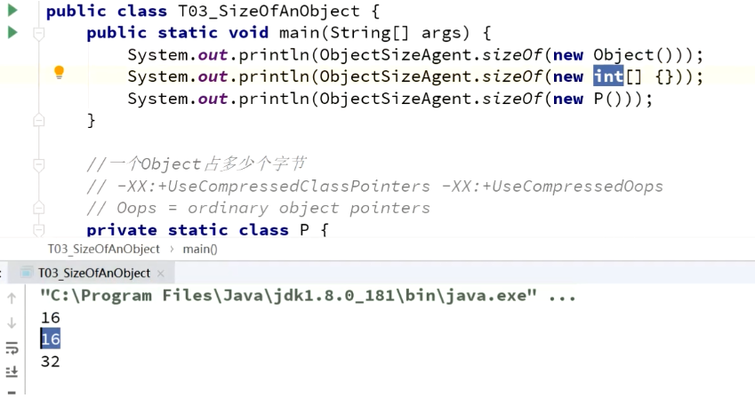

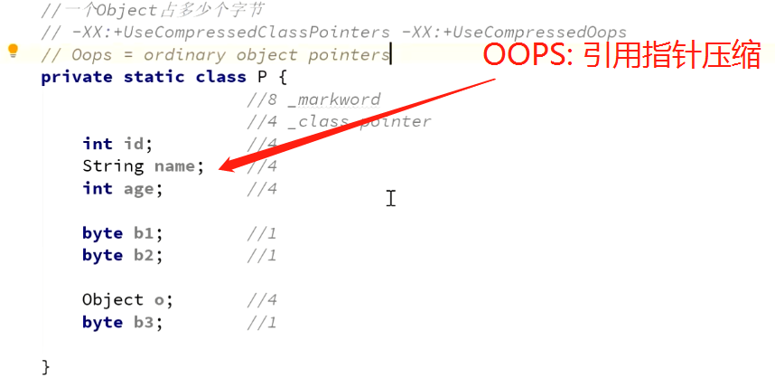

- 对象头具体包括什么
1. markword源码，c++ 实现
    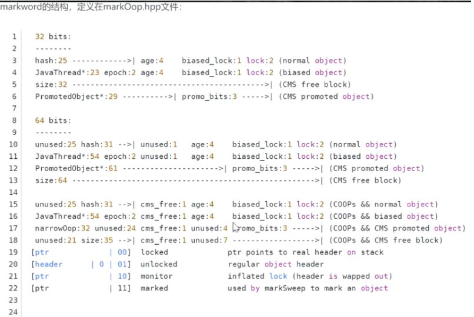
    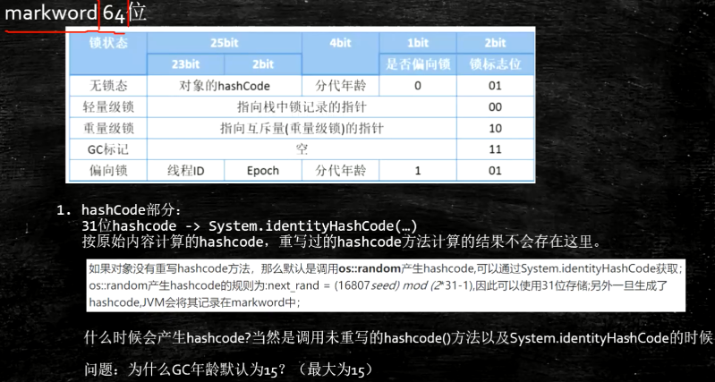
> 锁：三为，两位锁标记，一位偏向记录
> hashCode,重写，与默认（System.identityHashCode)
GC 分代大小 markword中gc分代年龄只有4位，所以最大是15
3. IdentityHashCode的问题
> 计算过IdentityHashCode之后 无法记录偏向锁状态，所以不能进入
- 直接指针（查找快）
5. 对象分配
