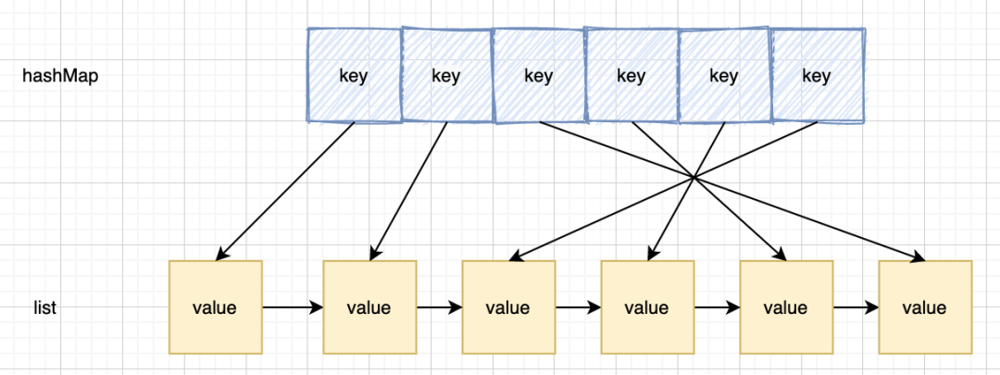
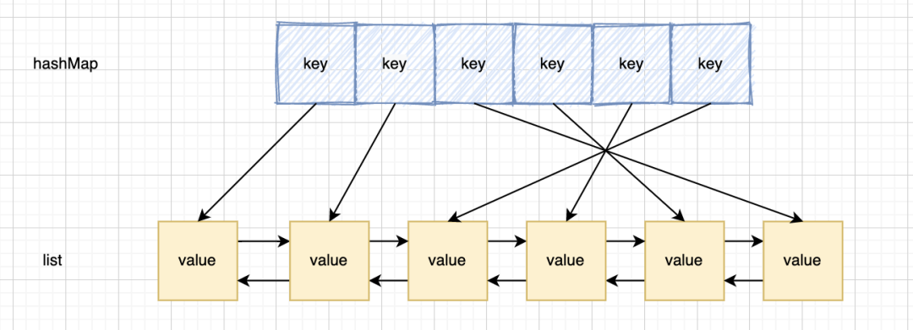
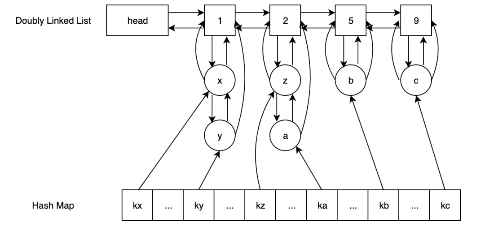
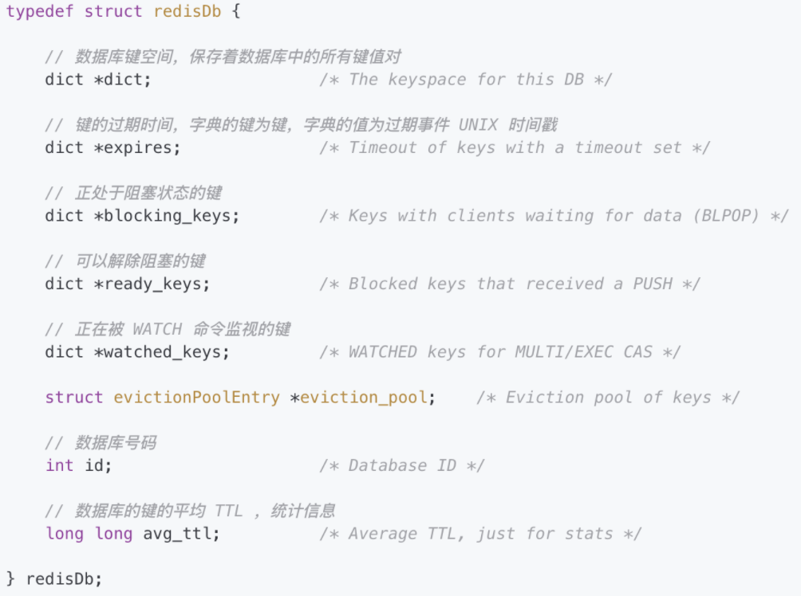
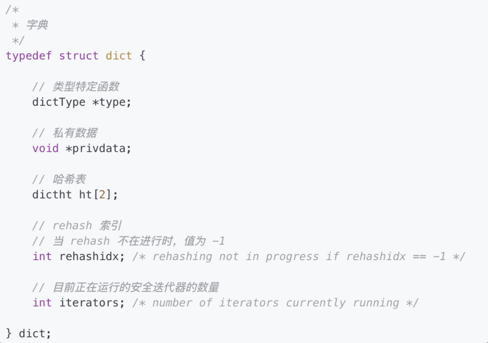
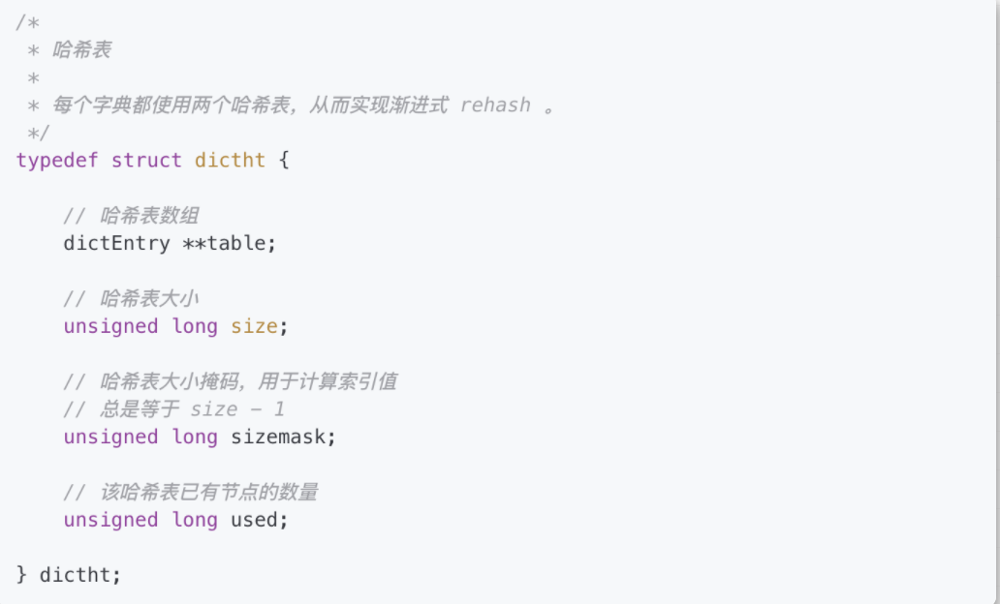

## Redis内存满了怎么办？

### **1 简介**

我们知道 Redis 是一个非常常用的内存型数据库，数据从内存中读取是它非常高效的原因之一，那么但是如果有一天，「Redis 分配的内存满了怎么办」？遇到这个面试题不要慌，这种问题我们分为两角度回答就可以：

- 「Redis会怎么做」
- 「我们可以怎么做」

### **2 增加 Redis 可用内存**

这种方法很暴力，也很好用。我们直接通过增加 Redis 可用内存就可以了， 有两种方式：

- 「通过配置文件配置」 ：通过在 Redis 安装目录下面的 redis.conf 配置文件中添加以下配置设置内存大小。

  ```
  //设置 Redis最大占用内存大小为1000M 
  maxmemory 1000mb
  ```

- 「通过命令修改」：Redis 支持运行时通过命令动态修改内存大小。

  ```
  //设置redis最大占用内存大小为1000M  
  127.0.0.1:6379> config set maxmemory 1000mb
  ```

这种方法的确立竿见影，Redis 内存总归受限于机器的内存，也不能无限制的增长。那么如果没有办法再增加 Redis 的可用内存怎么办呢？

### **3 内存淘汰策略**

实际上 Redis 定义了「8种内存淘汰策略」用来处理 Redis 内存满的情况：

1. 1. noeviction：直接返回错误，不淘汰任何已经存在的 Redis 键；
   2. allkeys-lru：所有的键使用 LRU 算法进行淘汰；
   3. volatile-lru：有过期时间的使用 LRU 算法进行淘汰；
   4. allkeys-random：随机删除 Redis 键；
   5. volatile-random：随机删除有过期时间的 Redis 键；
   6. volatile-ttl：删除快过期的 Redis 键；
   7. volatile-lfu：根据 LFU 算法从有过期时间的键删除；
   8. allkeys-lfu：根据 LFU 算法从所有键删除。

这些内存淘汰策略都很好理解，我们着重讲解一下 LRU、LFU、TTL 是如何实现。

#### **3.1 LRU 最佳实践**

LRU 是 Least Recently Used 的缩写，也就是「最近很少使用」，也可以理解成最久没有使用。最近刚刚使用过的，后面接着会用到的概率也就越大。由于内存是非常金贵的，导致我们可以存储在缓存当中的数据是有限的。比如说我们固定只能存储 1 万条，当内存满了之后，缓存每插入一条新数据，都要抛弃一条最长没有使用的旧数据。我们把上面的内容整理一下，可以得到几点要求：

- 保证其的读写效率，比如读写的复杂度都是O(1)
- 当一条数据被读取，将它最近使用的时间更新
- 当插入一条新数据的时候，删除最久没有使用过的数据

所以我们要尽可能的保证查询效率很高，插入效率很高。我们知道，如果只考虑查询效率，那么 hash 表可能就是最优的选择。如果只考虑插入效率，那么链表必定有它的一席之地。

但是这两种数据结构单独使用都有其弊端、那么说，有没有一种数据结构，既能够保证查询效率，又能够保证插入效率呢？于是 **hash+链表** 这种结构出现了。




hash 表用来查询在链表中的数据位置，链表负责数据的插入。当新数据插入到链表头部时有两种情况：

1. 当链表满的时候，将链表尾部的数据丢弃。这个比较简单，直接将链表尾部指针抹去，并且清除对应 hash 中的信息就好了。
2. 每当缓存命中（即缓存数据被访问），则将数据移到链表头部。这种情况我们发现，如果命中到链表中间节点，我们需要做的是：
   - 将该节点移到头节点
   - 将该节点的上一个节点的下一个节点，设置为该节点的下一个节点」。这里就会有一个问题，因为是单向链表，我们无法找到该节点的上一个节点。所以，新的模型产生了。



这时双向链表的作用也提现出来了。能直接定位到父节点。这效率就很高了。而且由于双向链表有尾指针，所以剔除最后的尾节点也十分方便快捷。

所以最终的解决方案就是采用「哈希表+双向链表」的结构。

#### **3.2 LFU 最佳实践**


LFU：Least Frequently Used，最不经常使用策略。在一段时间内，数据被「使用频次最少」的,优先被淘汰。最少使用（LFU）是一种用于管理计算机内存的缓存算法，主要是记录和追踪内存块的使用次数。

当缓存已满并且需要更多空间时，系统将以最低内存块使用频率清除内存。采用 LFU 算法的最简单方法是为每个加载到缓存的块分配一个计数器。每次引用该块时，计数器将增加一。当缓存达到容量并有一个新的内存块等待插入时，系统将搜索计数器最低的块并将其从缓存中删除。

这里我们提出一种达到 O(1) 时间复杂度的 LFU 实现方案，它支持的操作包括插入、访问以及删除。如下图所示：



由两个双向链表+哈希表组成。上方的双向链表用来计数，下方的双向链表用来记录存储的数据。该链表的头节点存储了数字，哈希表的 value 对象记录下方双向链表的数据、

我们这里按照插入的流程走一遍：

- 将需要存储的数据插入；
- 在 hash 表中「存在」，找到对应的下方双向链表，将该节点的上一个节点和该节点的下一个节点相连（这里可能只有自己，直接移除就好）。然后判断自己所在上方双向链表的计数是否比当前计数大1：
  - 「如果是」，则将自己移到该上方双向链表，并且「判断该双向链表下是否还有元素」。如果没有，则要删除该节点；
  - 「如果不是或者该上方双向列表无下个节点」则新加节点，将计数设为当前计数+1。
- 在 hash 表「不存在」，将数据存入hash表，将数据与双向链表的头节点相连（这里有可能链表未初始化）。

这样当查找，插入时效率都为 O(1)。


### **4 Redis TTL 是怎么实现的**

#### **4.1 TTL 存储的数据结构**

Redis 针对 TTL 时间有专门的 dict 进行存储。就是 redisDb 当中的 **dict\*expires** 字段。


dict 顾名思义就是一个 hashtable，key 为对应的 redis key，value 为对应的 TTL 时间。dict 的数据结构中含有 2 个 dictht 对象，主要是为了解决 hash 冲突过程中重新 hash 数据使用。








## **4.2 TTL 设置过期时间**

##  

TTL 设置 key 过期时间的方法主要是下面4个：

- expire：按照相对时间且以秒为单位的过期策略；
- expireat：按照绝对时间且以秒为单位的过期策略；
- pexpire：按照相对时间且以毫秒为单位的过期策略；
- pexpireat：按照绝对时间且以毫秒为单位的过期策略。

```json
{"expire",expireCommand,3,"w",0,NULL,1,1,1,0,0},
{"expireat",expireatCommand,3,"w",0,NULL,1,1,1,0,0},
{"pexpire",pexpireCommand,3,"w",0,NULL,1,1,1,0,0},
{"pexpireat",pexpireatCommand,3,"w",0,NULL,1,1,1,0,0},
```

#### **4.3 expire expireat pexpire pexpireat**

从实际设置过期时间的实现函数来看，相对时间的策略会有一个当前时间作为基准时间，绝对时间的策略会「以 0 作为一个基准时间」。

```java
void expireCommand(redisClient *c) {
	expireGenericCommand(c,mstime(),UNIT_SECONDS);
}
void expireatCommand(redisClient *c) {
	expireGenericCommand(c,0,UNIT_SECONDS);
}
void pexpireCommand(redisClient *c) {
	expireGenericCommand(c,mstime(),UNIT_MILLISECONDS);
}
void pexpireatCommand(redisClient *c) {
	expireGenericCommand(c,0,UNIT_MILLISECONDS);
}
```

整个过期时间最后都会换算到绝对时间进行存储，通过公式**基准时间+过期时间**来进行计算。

对于相对时间而言基准时间就是当前时间，对于绝对时间而言相对时间就是 0。中途考虑设置的过期时间是否已经过期，如果已经过期那么在 master 就会删除该数据并同步删除动作到 slave。

正常的设置过期时间是通过 setExpire 方法保存到 dict *expires 对象当中。

```java
/**
 * 这个函数是 EXPIRE 、 PEXPIRE 、 EXPIREAT 和 PEXPIREAT 命令的底层实现函数。
 * 命令的第二个参数可能是绝对值，也可能是相对值。
 * 当执行 *AT 命令时， basetime 为 0 ，在其他情况下，它保存的就是当前的绝对时间。
 * unit 用于指定 argv[2] （传入过期时间）的格式，
 * 它可以是 UNIT_SECONDS 或 UNIT_MILLISECONDS ，
 * basetime 参数则总是毫秒格式的。
 */
void expireGenericCommand(redisClient *c, long long basetime, int unit) {   
    robj *key = c->argv[1], *param = c->argv[2];   long long when; /* unix time in milliseconds when the key will expire. */
    
   // 取出 when 参数   
    if (getLongLongFromObjectOrReply(c, param, &when, NULL) != REDIS_OK)       return;
   // 如果传入的过期时间是以秒为单位的，那么将它转换为毫秒   
    if (unit == UNIT_SECONDS) when *= 1000;   when += basetime;
   /* No key, return zero. */  
   // 取出键   
    if (lookupKeyRead(c->db,key) == NULL) {
        addReply(c,shared.czero);      
        return;
    }
   /** 
    * 在载入数据时，或者服务器为附属节点时，    
    * 即使 EXPIRE 的 TTL 为负数，或者 EXPIREAT 提供的时间戳已经过期，    
    * 服务器也不会主动删除这个键，而是等待主节点发来显式的 DEL 命令   
    * 程序会继续将（一个可能已经过期的 TTL）设置为键的过期时间，    
    * 并且等待主节点发来 DEL 命令。    
    */   
    if (when <= mstime() && !server.loading && !server.masterhost) {
       // when 提供的时间已经过期，服务器为主节点，并且没在载入数据
       robj *aux;
       redisAssertWithInfo(c,key,dbDelete(c->db,key));      
        server.dirty++;
       /* Replicate/AOF this as an explicit DEL. */      
        // 传播 DEL 命令      
       aux = createStringObject("DEL",3);
       rewriteClientCommandVector(c,2,aux,key);       
       decrRefCount(aux);
       signalModifiedKey(c->db,key);       
       notifyKeyspaceEvent(REDIS_NOTIFY_GENERIC,"del",key,c->db->id);
       addReply(c, shared.cone);
       return;   
    } else {
       // 设置键的过期时间       
        // 如果服务器为附属节点，或者服务器正在载入，       
        // 那么这个 when 有可能已经过期的      
       setExpire(c->db,key,when);
       addReply(c,shared.cone);
       signalModifiedKey(c->db,key);       
       notifyKeyspaceEvent(REDIS_NOTIFY_GENERIC,"expire",key,c->db->id);
       server.dirty++;
       return;   
    }
}
 setExpire函数主要是对db->expires中的key对应的dictEntry设置过期时间。
/** 将键 key 的过期时间设为 when*/
   void setExpire(redisDb *db, robj *key, long long when) {
   dictEntry *kde, *de;
   /* Reuse the sds from the main dict in the expire dict */   
   // 取出键   
   kde = dictFind(db->dict,key->ptr);
   redisAssertWithInfo(NULL,key,kde != NULL);
   // 根据键取出键的过期时间   
   de = dictReplaceRaw(db->expires,dictGetKey(kde));
   // 设置键的过期时间   
   // 这里是直接使用整数值来保存过期时间，不是用 INT 编码的 String 对象   
   dictSetSignedIntegerVal(de,when);
 }
```

#### **4.4 R****edis 什么时候执行淘汰策略**

在 Redis 中有三种删除的操作此策略：

- 定时删除：对于设有过期时间的 key，时间到了，定时器任务立即执行删除。因为要维护一个定时器，所以就会占用 CPU 资源。尤其是有过期时间的 Redis 键越来越多损耗的性能就会线性上升。
- 惰性删除：每次只有再访问 key 的时候，才会检查 key 的过期时间，若是已经过期了就执行删除。这种情况只有在访问的时候才会删除，所以有可能有些过期的 Redis 键一直不会被访问，就会一直占用 Redis 内存。
- 定期删除：每隔一段时间，就会检查删除掉过期的 key。这种方案相当于上述两种方案的折中，通过最合理控制删除的时间间隔来删除 key，减少对 CPU 的资源的占用消耗，使删除操作合理化。

**5 参考文档**

- https://www.jianshu.com/p/53083f5f2ddc
- https://zhuanlan.zhihu.com/p/265597517


推荐阅读 点击标题可跳转

[吊打面试官：Redis 缓存雪崩、击穿、穿透](http://mp.weixin.qq.com/s?__biz=MjM5NzMyMjAwMA==&mid=2651489177&idx=1&sn=bc28ee6f41e9dfff39cd4df69ab45870&chksm=bd25efe68a5266f00ee5c06727a409d22c6bb840453e5f6b1803d3f2d62da25b95ebcbe1ad56&scene=21#wechat_redirect)

[一文读懂Redis常见对象类型的底层数据结构](http://mp.weixin.qq.com/s?__biz=MjM5NzMyMjAwMA==&mid=2651490982&idx=1&sn=2bbc872da6381b911639a1a37df06a96&chksm=bd25e6d98a526fcf8712832843e5194405dcdd9d0bc58b5bfcd9fe10ce0d7151597b9797c7bb&scene=21#wechat_redirect)

[Redis最佳实践：7个维度+43条使用规范，带你彻底玩转Redis](http://mp.weixin.qq.com/s?__biz=MjM5NzMyMjAwMA==&mid=2651493488&idx=1&sn=b0c1bd447efec973adbde6059763f792&chksm=bd25f80f8a52711968e9e35783c2d460de02251ad2c9f4006f523faff6e2af71927c50e80916&scene=21#wechat_redirect)