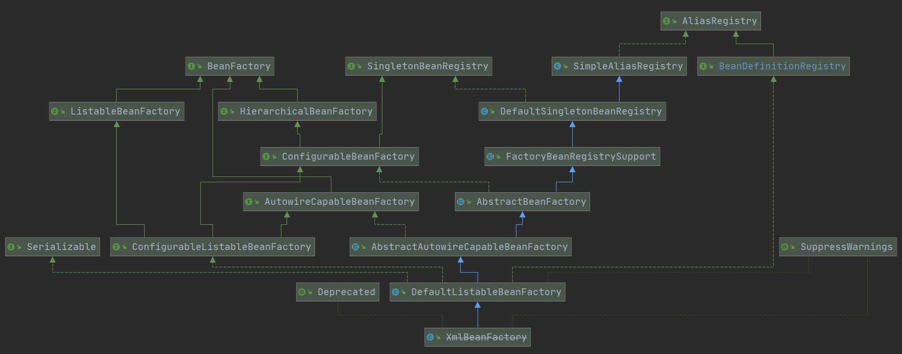

### Spring源码核心类介绍

#### 1. DefaultListableBeanFactory 

> Spring注册加载bean的核心类， **XmlBeanFactory**与**DefaultListableBeanFactory**不同的地方其实是在**XmlBeanFactory**中使用了自定义的XML读取器**XmlBeanDefinitionReader**，实现了个性化的**BeanDefinitionReader**读取，**DefaultListableBeanFactory**继承了**AbstractAutowireCapableBeanFactory**并实现了**ConfigurableListableBeanFactory**以及**BeanDefinitionRegistry**接口

#### 2. 各类功能介绍

##### 1. DefaultListableBeanFactory

- **AliasRegistry（I）** ：定义别名的简单增删改，检查方法

- **SimpleAliasRegistry （C）: **  主要使用map作为alias的缓存，并对接口**AliasRegistry**进行实现。

- **SingletonBeanRegistry （I）：**定义对单例的注册及获取。

- **BeanFactory （I）：**定义各种获取bean及bean的各种属性的方法。

- **DefaultSingletonBeanRegistry （C）：**对接口**SingletonBeanRegistry**各函数的实现。一 二 三级缓存，循环依赖问题

- **HierarchicalBeanFactory（I）：**继承**BeanFactory**，也就是在**BeanFactory**定义的功能的基础上增加了对**parentFactory**的支持

- **BeanDefinitionRegistry（I）：**定义对**BeanDefinition**的各种增删改操作。继承了 **AliasRegistry**

- **FactoryBeanRegistrySupport（C）：**主要有由**FactoryBeans**创建的单例对象的Map缓存， **DefaultSingletonBeanRegistry**基础上增加了对**FactoryBean**的特殊处理功能，支持单例注册表的基类，处理**FactoryBean** 对象，与**DefaultSingletonBeanRegistry**的单例管理集成

- **ConfigurableBeanFactory（I）：**提供配置Factory的各种方法。

  - 添加父类工厂**ParentBeanFactory**
  - 设置类加载器 **ClassLoader**
  - 表达式解析器（占位符替换）**BeanExpressionResolver**
  - 属性编辑器**PropertyEditorRegistrar**
  - 属性转换器**TypeConverter**
  - 自定属性编辑器注册表**registerCustomEditor**
  - 添加**BeanPostProcessor**应用于createBean
  - 字符串解析器**StringValueResolver**适用与注解属性值

- **ListableBeanFactory（I）：**根据各种条件获取**bean**定义信息配置清单。**BeanDefinitionNames**

- **AbstractBeanFactory（C）：BeanFactory**实现的抽象基类，综合了**FactoryBeanRegistrySupport**和**ConfigurableBeanFactory**，提供了**ConfigurableBeanFactory SPI**（**Service Provider Interface**,是JDK内置的一种服务提供发现机制）的全部功能功能。

- **AutowireCapableBeanFactory（I）：**提供创建bean、自动注入、初始化以及应用bean的后处理器。

- **AbstractAutowireCapableBeanFactory（C）：**综合**AbstractBeanFactory**并对接口**AutowireCapableBeanFactory**进行实现。

- **ConfigurableListableBeanFactory（I）：BeanFactory**配置清单，指定忽略类型及接口等。

- **DefaultListableBeanFactory（C）：**综合上面所有功能，主要是对Bean注册后的处理。

- **XmlBeanFactory**对**DefaultListableBeanFactory**进行扩展，添加 **XmlBeanDefinitionReader**类型的Reader属性，使用reader属性对资源文件进行读取和注册

  

##### 2. XmlBeanDefinitionReader

- **ResourceLoader（I）：**定义资源加载器，主要应用于根据给定的资源文件地址返回对应的Resource。
- **BeanDefinitionReader（C）：**主要定义资源文件读取并转换为BeanDefinition的各个功能。
- **EnvironmentCapable（I）：**定义获取Environment方法。
- **AbstractBeanDefinitionReader（C）：**对**EnvironmentCapable、BeanDefinitionReader**类定义的功能进行实现。
- **DocumentLoader（I）：**定义从资源文件加载到转换为Document的功能。
- **DefaultDocumentLoader（C）: DocumentLoader**默认实现类
- **BeanDefinitionDocumentReader（I）：**定义读取Docuemnt并注册BeanDefinition功能。
- **DefaultBeanDefinitionDocumentReader（C）：BeanDefinitionDocumentReader**的实现类
- **BeanDefinitionParserDelegate（C）：**定义解析Element的各种方法。配合**DefaultBeanDefinitionDocumentReader**工作


### **spring启动过程扩展点**

#### 1. 添加启动过程关键数据校验

```java
// 重写 AbstractApplicationContext#initPropertySources 方法
@Override
protected void initPropertySources() {
    System.out.println("扩展initPropertySource");
    getEnvironment().setRequiredProperties("username");
}


// 留给子类覆盖，初始化属性资源
initPropertySources();
// 创建并获取环境对象，验证需要的属性文件是否都已经放入环境中
getEnvironment().validateRequiredProperties();

// 前戏准备工作中对添加数据校验 实际执行的方法
// AbstractPropertyResolver#validateRequiredProperties
@Override
public void validateRequiredProperties() {
    MissingRequiredPropertiesException ex = new MissingRequiredPropertiesException();
    for (String key : this.requiredProperties) {
        if (this.getProperty(key) == null) {
            ex.addMissingRequiredProperty(key);
        }
    }
    if (!ex.getMissingRequiredProperties().isEmpty()) {
        throw ex;
    }
}
```


#### 2. 不用同名覆盖，循环依赖

```java
// 重写   AbstractRefreshableApplicationContext # customizeBeanFactory 方法
@Override
protected void customizeBeanFactory(DefaultListableBeanFactory beanFactory) {
    super.setAllowBeanDefinitionOverriding(false);
    super.setAllowCircularReferences(false);
    super.addBeanFactoryPostProcessor(new MyBeanFactoryPostProcessor());
    super.customizeBeanFactory(beanFactory);
}
```

#### 3. 自定义标签扩张

- 加载 spring.handlers配置文件
- 将配置文件内容加载到map集合
- 根据指定的key获取对应的处理器

```
// 定义一个自定义标签属性值的类 User
// 创建对应的parser解析器 继承 AbstractSingleBeanDefinitionParser
	也可以继承 AbstractSingleBeanDefinitionParser的子类（额外标签处理，有用的情况下继承）
// 创建NamespaceHandler 子类UserNamesPaceHandler （在 int方法，添加parser类）
// 创建一个普通的spring-handlers配置文件
// 创建对应标签的parser类
```

####   4. 自定义属性编辑器

> 属性转换 ：配置文件中所有值都是 String类型，需要转换成对应类型值

1. 自定义一个实现 PropertyEditorSupport 接口的编辑器 **setAsText()**
2. 自定义实现一个属性编辑器，实现PropertyEditorRegistrar接口
3. 让Spring识别到对应的注册器

#### 5. 自定义 Aware

```
// 定义 MyAwareProcessor 实现 BeanPostProcessor 接口，实现 postProcessBeforeInitialization() 方法
```


### 附加篇

#### 1. springBoot怎么实现的自动装配

- 启动类上边有  **@SpringBootApplication --> @EnableAutoConfiguration --> @Import(EnableAutoConfigurationImportSelector.class)**注解
- 识别 **EnableAutoConfiguration** 类之后会加载 **META-INF/spring.factories** 配置文件里边对应属性
- **@Import(EnableAutoConfigurationImportSelector.class)** 注解是在spring启动过程中 执行实现**BeanFactoryPostProcessor（BFPP）** 接口类中的方法**postProcessBeanDefinitionRegistry** 时候，在解析注解的核心类**ConfigurationClassPostProcessor** 处理的 
- 处理的注解包括：**@Component @ComponentScan @PropertySource @Import @ImportResource @Bean** 等
- 解析**@Import** 注解时候有一个延迟加载的方法 getImports()

#### 2. @Configuration 注解添加的类都需要生成动态代理对象