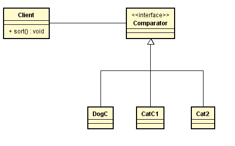
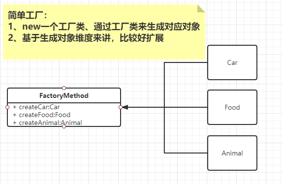

### **设计模式列表**

#### 1、创建型模式

-  Abstract Factory
- Builder 
- Factory Method
- Prototype
- Singleton

#### 2、结构型模式

- Adapter
- Bridge
- Composite
- Decorator
- Facade
- Flyweight
- Proxy

#### 3、行为模式

- Chain of Responsibility. 
- Command. 
-  Interpreter. 
-  Iterator 
-  Mediator
- Memento.. 
- Observer 
- State.. 
- Strategy. 
- Template Method.. 
- Visitor

### **1、Singleton-单例模式**

```java
public class SingletonMode {
    /**
     * 饿汉式
     * 1、类加载到内存后、、就实例化一个单例、jvm保证线程安全
     * 2、简单实用、推荐使用
     */
    private static final SingletonMode SINGLETON_MODE = new SingletonMode();
    //构造方法私有
    private SingletonMode() {}
    public SingletonMode getSingleMode() {
        return SINGLETON_MODE;
    }

    /**
     * lazy loading
     * DCL 模式
     */
    private static volatile SingletonMode single;
    public SingletonMode getSingle() {
        if (single == null) {
            synchronized (this) {
                if (single == null) {
                    single = new SingletonMode();
                }
            }
        }
        return single;
    }
}
```

### 2、Strategy-策略模式

java/util/Comparator.java



- 封装程序执行的方式

```java
// 比较器 -1  0  1
int compare(T o1. To2);
boolean equals(Object obj);
```

java/lang/Comparable.java

### 3、Factory-工厂模式

- 任何可以产生对象的方法或类、都可以称之为工厂
- 单例也是一种工厂
- 为啥有了new之后 还要有工厂
  - 灵活控制生产过程
  - 权限、修饰、日志~~~

#### 1、simple-Factory

#### 2、factory-method




#### 3、abstract-factory （SpringIOC）

使用场景：页面皮肤一件切换

- 抽象工厂 ——> 具体工厂——>生产具体产品
- 产品抽象 ——> 具体产品
- 交通工具 ——> 汽车

- 产品族进行扩展

```
形容词用接口: 可以做什么、行为化。比如：run
名称用抽象类：某一类产品，物种等 比如：动物、食物、武器、交通工具
```


### 4、Facade-门面&Mediator - 调停者

- **Facade**一站式服务、统一 一个借口对外服务

- **Mediator** 内部调停

  

解决个业务模块耦合问题：

1. Facade（门面）
   1. 统一接口
   2. 内部数据处理
2. 业务模块包装类

### 5、Decorator-装饰器（聚合代替继承）

- 针对一个对象、添加装饰（女人、穿衣服、带项链、戒指~~~）


### 6、Chain Of Responsibility-责任链

- selvert应用：过滤器 —— FilterChain


### 7、Observer-观察者模式

- 监听某个对象或事件状态、做出不同处理
- 基于事件驱动：Event:: getSource()


```
Observer
Listener
Hook
Callback
```

#### 观察者模式升级：（被观察者，观察者 行为抽象化）

- 事件： 被观察者具体行为

- 监听器： 接收被观察者不同事件，处理不同工作

- 多播器： 把循环观察者集合，委托给一个多播器进行消息通知，通知观察者进行不同操作

- 事件源： 谁来调用或者执行发布具体的事件

  ```java
  // 伪代码
  // 1. 定义N个事件对象
  // 2. 初始化多播器，（定义监听器集合属性，添加对监听器的CRUD方法）
  // 3. 初始化N个监听器， 注册添加到多播器中
  // 4. 发布事件
  ```

  

### 8、Composite-组合模式

- 处理树状结构


### 9、Flyweight-享元

- 池子里边有就直接拿来用

  

### 10、proxy-代理

- JDK动态代理处理过程

- spring-AOP

  

### 11、Iterator-迭代