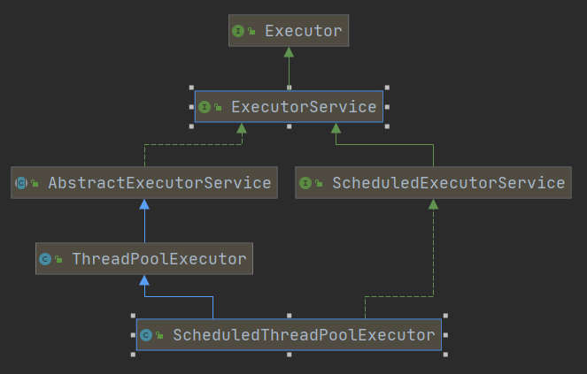

### 第一章 多线程基础

#### 1. 线程间通信

- 方式1  wait()**/**notify() 必须与 synchronized 配合使用

  - wait()  --- 线程阻塞进入等待状态

  - notify() --- 唤醒 waitting 状态中的任意一个线程  notifyAll() -- 唤醒所有

    ```java
    // 这两个方法必须 配合 synchronized 关键字使用
    // wait() 方法内部会先释放锁，然后进入阻塞状态
    wait(){
    	// 释放锁
    	//阻塞，等待被其他线程 notify()
    	// 重新拿锁
    }
    ```

    **总结：**
    
    ```java
    Java中的多线程是一种抢占式的机制，而不是分时机制。抢占式的机制是有多个线程处于可运行状态，但是只有一个线程在运行。 
    共同点 ： 
    1. 他们都是在多线程的环境下，都可以在程序的调用处阻塞指定的毫秒数，并返回。 
    2. wait()和sleep()都可以通过interrupt()方法 打断线程的暂停状态 ，从而使线程立刻抛出InterruptedException。 
    如果线程A希望立即结束线程B，则可以对线程B对应的Thread实例调用interrupt方法。如果此刻线程B正在wait/sleep/join，则线程B会立刻抛出InterruptedException，在catch() {} 中直接return即可安全地结束线程。 
    需要注意的是，InterruptedException是线程自己从内部抛出的，并不是interrupt()方法抛出的。对某一线程调用 interrupt()时，如果该线程正在执行普通的代码，那么该线程根本就不会抛出InterruptedException。但是，一旦该线程进入到 wait()/sleep()/join()后，就会立刻抛出InterruptedException 。 
    不同点 ： 
    1.每个对象都有一个锁来控制同步访问。Synchronized关键字可以和对象的锁交互，来实现线程的同步。 
    sleep方法没有释放锁，而wait方法释放了锁，使得其他线程可以使用同步控制块或者方法。 
    2.wait，notify和notifyAll只能在同步控制方法或者同步控制块里面使用，而sleep可以在任何地方使用 
    3.sleep必须捕获异常，而wait，notify和notifyAll不需要捕获异常 
    4.sleep是线程类（Thread）的方法，导致此线程暂停执行指定时间，给执行机会给其他线程，但是监控状态依然保持，到时后会自动恢复。调用sleep不会释放对象锁。
    5.wait是Object类的方法，对此对象调用wait方法导致本线程放弃对象锁，进入等待此对象的等待锁定池，只有针对此对象发出notify方法（或notifyAll）后本线程才进入对象锁定池准备获得对象锁进入运行状态
    ```
    
    

- Condition机制  --- 必须和 Lock 一起使用

  
  
  

### 第二章  原子类（Atomic）

**Unsafe 类中 CAS实现原子操作**

#### 1. ABA 问题

1. AtomicStampedRefference 这个类中 CAS 操作有四个参数，

   ```java
   // 前两个参数比较修改值
   // 后两个参数比较版本号 解决 ABA问题
   public boolean compareAndSet(V   expectedReference,
                                    V   newReference,
                                    int expectedStamp,
                                    int newStamp) {
           Pair<V> current = pair;
           return
               expectedReference == current.reference &&
               expectedStamp == current.stamp &&
               ((newReference == current.reference &&
                 newStamp == current.stamp) ||
                casPair(current, Pair.of(newReference, newStamp)));
       }
   ```

2. AtomicMarkableReference 

   1. 原理与 AtomicStampedRefference 这个类似 **AtomicMarkableReference** 对象里的版本号是 boolean类型 只能表示两中状态，可以有效缓解ABA问题，但是无法避免

#### Striped64 与 LongAdder

1. 大数字  分而治之 ---  把一个Long类型拆成一个 base变量外加多个 Cell，每个Cell包装一个Long变量，多个线程并发累加时候并发度


### 第六章 线程池与Future

#### 1. 线程池实现原理

- 容器中有一组线程 **+** 队列，调用方往队列里添加任务，线程不断从队列里取任务执行 （生产 -- 消费者模型）

**需要考虑问题：**

1. 线程数是固定的还是动态的，需要设置多少线程数
   1. 设置核心线程数，最大线程数
   2. N = N(cpu) * U(cpu) * (1 + W/C)
      - cpu 核数 （ **Runtime.getRuntime().availaableProcessors()** ）
      - U(cpu) CPU使用率 (0, 1)
      - waiting / count（等待时间 / 计算时间）
2. 队列大小怎么设置，无界调用放一直调用可能会导致内存耗尽，有界队列，队列满了，新添加的任务需要怎么处理
3. 提交任务时候 新开线程，还是添加队列
4. 当没有任务时候，线程是睡眠一小段时间？还是进入阻塞？如果进入阻塞，如何唤醒？
   - 使用阻塞队列

#### 类继承关系



##### ThreadPooleExecutor (参数详解)

1. corePoolSize // 核心线程数
2. maximumPoolSize // 最大线程数
3. keepAliveTime // 没有任务时 线程活跃时间
4. nuit //
5. workQueue // 阻塞队列
6. threadFactory // 指定线程工厂
7. handler // 拒绝策略
   1. jdk默认提供了四种（ThreadPooleExecutor 的内部类 都实现了 RejectedExecutionHandler接口 ）
      - 交给调用方执行 -- CallerRunsPolicy
      - 抛出异常 --- AbortPolicy
      - 悄咪咪的吃掉 ---- DiscardPolicy
      - 丢掉等待时间最长的任务 --- DiscardOldPolicy

 

#### 2. 四种并发模型

1. 并行工作者（Parallel ） --- 传入的任务被分配到不同的工作者上
   - 优点，添加更多工作者来提高系统并行度，
   - 缺点：（业务数据，缓存数据，数据库连接池等）
     - 共享状态数据的同步 会比较复杂，对共享数据的操作要保证线程可见，避免资源竞争，死锁等问题
     - 访问共享数据，线程之间的相互竞争，资源 性能损耗，出现一定程度的串行化
     - 任务执行顺序不确定
2. 流水线模型 （Callback） --- 无共享并行模型
   - 类似生产车间流水线上的工人，每个工人只负责一部分任务，当完成自己任务时，会转发给下一个工作者
   - 优点：
     - 无共享状态，无需考虑并发访问共享数据产生的并发性问题，基本类似于单线程操作
     - 合理的作业顺序
   - 缺点：
     - 回调函数嵌套问题
3. 函数式并行模型

