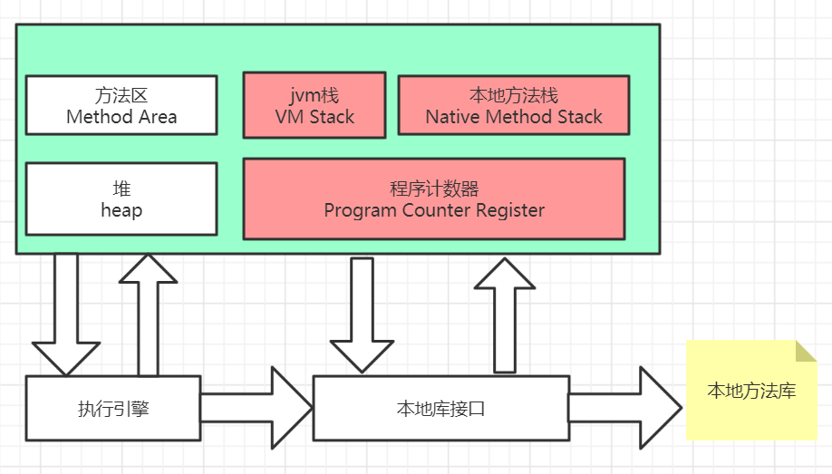

### 第二部分 自动内存管理

#### 第二章 java内存区域与内存溢出异常

##### 2.1 java内存模型-区域划分

###### 1. 方法区

> jdk1.8之前--永久代（）1.8之后 元数据区

1. 存放，类加载信息，常量，静态变量，及时编译代码缓存
2. 设置大小参数 -XX: perminSize
3. 线程共享数据区域

###### 2. JVM Stack

1. 每个方法对应一个栈帧 Stack Frame
2. 存储局部变量表，操作数栈，动态链接，方法返回等信息
   - 局部变量表存放基础数据类型（boolean, byte, char, short, int, float, double, long）引用数据类型（reference 类型）
   - double, long 会占用两个变量槽，其余的数据类型只占用一个
3. 线程私有内存

